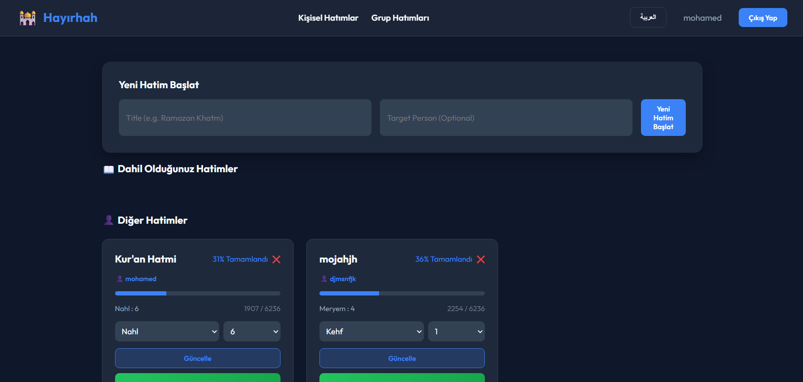

# 🕌 Hayırhah - Quran Khatma Tracker (متابع الختمات القرآنية)

**Hayırhah** هو تطبيق ويب متكامل ومؤمن لتتبع وإدارة الختمات القرآنية، سواء كانت ختمات فردية خاصة بالقرّاء، أو ختمات جماعية تشاركية يساهم فيها مجموعة من المستخدمين لتوزيع أجزاء القرآن الـ 30 فيما بينهم مع إمكانية القراءة المباشرة من المصحف الإلكتروني ومتابعة نسب الإنجاز بدقة.

يدعم التطبيق اللغتين **العربية** و **التركية** بالكامل بشكل ديناميكي (RTL/LTR).

---

## 📸 واجهة المشروع (Screenshots)



---

## ✨ المميزات الرئيسية (Key Features)

### 1. نظام الحسابات والتأمين (Authentication & Security)
* تسجيل حساب جديد وتسجيل الدخول بشكل آمن.
* تشفير كلمات المرور في قاعدة البيانات باستخدام مكتبة **bcrypt**.
* حماية الجلسات والمسارات باستخدام **JWT (JSON Web Tokens)**.
* تسجيل خروج تلقائي وآمن للمستخدم في حال انتهاء صلاحية الجلسة (403/401).

### 📖 2. الختمات الفردية (Individual Khatmas)
* بدء ختمة فردية لنفسك أو إهدائها لشخص آخر.
* تحديد مكان التوقف بدقة (رقم السورة ورقم الآية).
* شريط تقدم تفاعلي يتغير لونه ديناميكياً حسب نسبة الإنجاز.
* مصحف إلكتروني مدمج لحفظ تقدم القراءة تلقائياً عند الضغط على الآية التي توقفت عندها.

### 👥 3. الختمات الجماعية التشاركية (Group Khatmas) - *ميزة جديدة*
* إنشاء ختمة جماعية باسم مخصص (مثل: ختمة رمضان، ختمة العائلة).
* تقسيم الختمة تلقائياً إلى 30 جزءاً (Juz) متاحاً للحجز.
* إمكانية حجز جزء واحد أو عدة أجزاء من قبل أي مستخدم مسجل.
* **المشاركة كفاعل خير (Anonymous Mode):** إمكانية إخفاء الاسم الحقيقي بجانب الأجزاء المحجوزة والظهور كـ "فاعل خير" لحماية الخصوصية، مع الاحتفاظ بملكية الجزء برمجياً.
* حساب نسبة الإنجاز والتقدم لكل مشارك على حدة بناءً على الأجزاء التي حجزها فقط.
* حساب نسبة الإنجاز الكلية للختمة الجماعية وتحديث حالتها تلقائياً (`مفتوحة` -> `محجوزة بالكامل` -> `مكتملة`).
* **مصحف الأجزاء:** زر مدمج لقراءة الجزء المحجوز تحديداً داخل المصحف الإلكتروني المقسم حسب الأجزاء والسور.

### 🗄️ 4. لوحة الإدارة وقاعدة البيانات (Database Admin Dashboard)
* لوحة تحكم مدمجة للمشرفين على الرابط `/admin` تعرض إحصائيات قاعدة البيانات الحقيقية (المستخدمين النشطين، الختمات، والتقدم) بشكل منسق وجذاب.

---

## 🛠️ التقنيات المستخدمة (Tech Stack)

### الواجهة الأمامية (Frontend):
* **React.js** (مع **Vite** للبناء السريع).
* **React Router Dom** لإدارة الانتقالات والروابط.
* **Axios** للاتصال بالخادم.
* **i18next** لإدارة اللغات والترجمة الفورية.
* **Vanilla CSS** بتصميم داكن (Dark Mode) عصري ومؤثرات حركية خفيفة.

### الواجهة الخلفية وقاعدة البيانات (Backend):
* **Node.js** مع إطار العمل **Express.js**.
* **SQLite** كقاعدة بيانات علائقية خفيفة ومدمجة.
* **JWT & bcrypt** لإدارة الأمان والتوثيق.
* استهلاك **Alquran Cloud API** لجلب آيات وسور وجداول المصحف الشريف.

---

## 🚀 طريقة التشغيل والتركيب (Installation & Running)

### المتطلبات الأساسية:
* تثبيت بيئة [Node.js](https://nodejs.org/).

### 1. تشغيل السيرفر (Backend):
```bash
cd backend
npm install
npm run dev
```
*سيعمل السيرفر على المنفذ `http://localhost:5000` وسيقوم بإنشاء قاعدة البيانات تلقائياً.*

### 2. تشغيل الواجهة (Frontend):
```bash
cd frontend
npm install
npm run dev
```
*ستعمل الواجهة على المنفذ `http://localhost:5173`.*

---

## 📁 هيكلية المجلدات (Project Structure)
```text
uyglama22/
├── backend/            # خادم Node.js + Express
│   ├── routes/         # مسارات الـ API (لوحة التحكم والـ Admin)
│   ├── db.js           # إعداد وإدارة جداول SQLite
│   ├── server.js       # نقطة تشغيل السيرفر والـ APIs
│   └── database.sqlite # ملف قاعدة البيانات (يتولد تلقائياً)
├── frontend/           # تطبيق React + Vite
│   ├── public/         # الأيقونات والملفات العامة
│   └── src/            # مكونات وعناصر الواجهة
│       ├── assets/     # الصور والملفات المساعدة
│       ├── App.jsx     # ملف التوجيه والصفحات الأساسية
│       ├── QuranReader.jsx # مصحف الختمات الفردية
│       ├── JuzReader.jsx   # مصحف الختمات الجماعية (مقسم بالجزاء)
│       └── i18n.js     # ملف الترجمات واللغات
└── README.md           # هذا الملف
```

---

## 👤 إعداد وتطوير
* **المطور:** Mohamed Ayman (MOHAMEDAYMEN12)
* **المشروع:** مشروع تخرج / تقرير مشروع تتبع الختمات القرآنية.
